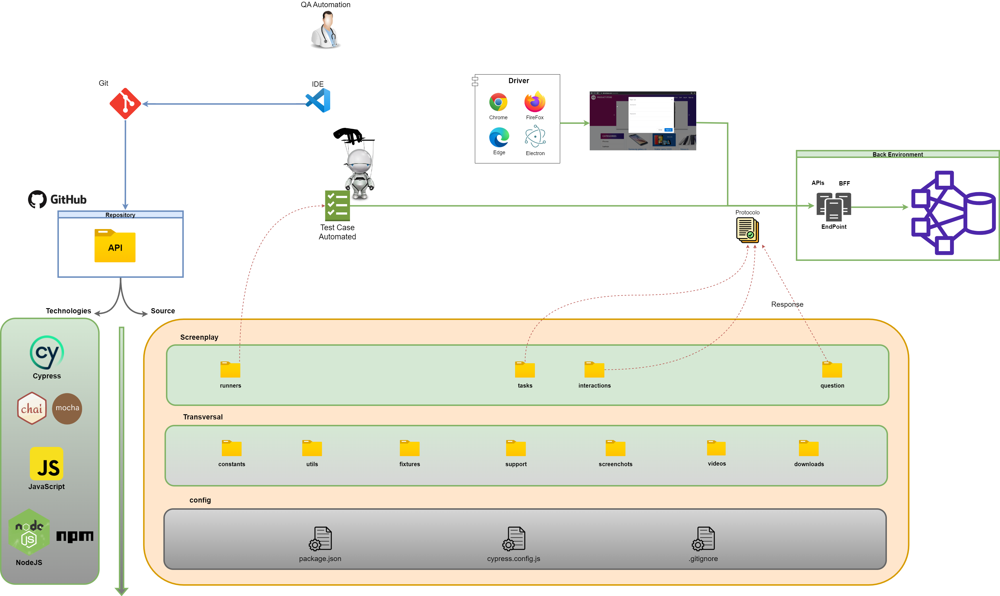
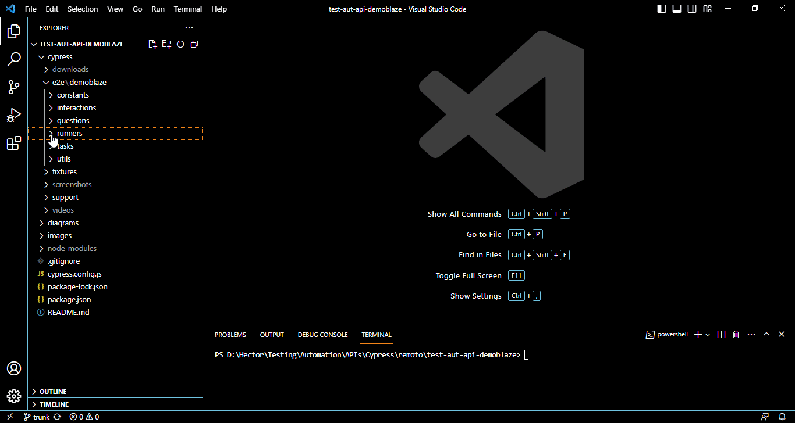

# 🦾 Automatización de Pruebas API - Demoblaze 🦾

Este proyecto de automatizacion API hecho en JavaScript-NodeJS/npm con Cypress y Screenplay-pattern, 
refleja los scripts de pruebas automatizadas sobre diferentes servicios API para su consumo desde www.demoblaze.com

<br>

<div id='menu'/>

## 📚 Tabla de contenido: 
1. [Arquitectura](#arquitectura)
   1. [Diagrama Conceptual](#arquitectura_diagrama_conceptual)
   2. [Patron de Diseño](#patron_diseno)
   3. [Estructura de Proyecto](#arquitectura_estructura_proyecto)
2. [Tecnologias / Herramientas](#tecnologias_herramientas)
3. [Pre-requisitos](#pre_requisitos) 
4. [Instalación](#instalacion) 
5. [Ejecución](#ejecucion) 
6. [Informe](#informe)
7. [Ambiente](#ambientes)
8. [Autores](#autores) 

<br>

<div id='arquitectura'/>

##  📐 Arquitectura [📚](#menu)

<br>

<div id='arquitectura_diagrama_conceptual'/>

### Diagrama Conceptual [📚](#menu) 


[Generado en draw.io](https://app.diagrams.net/): ../diagrams/readme/diagrama_conceptual_arquitectura.drawio

<br>

<div id='patron_diseno'/>

### Patron de Diseño [📚](#menu)
**Screenplay**


>"Screenplay es un patrón de diseño de automatización de prueba moderno que 
pretende facilitar la escritura de código de prueba escalable y mantenible 
(segun los principios SOLID)
> > En Screenplay modelamos actores que interactúan con una aplicación de varias maneras 
para realizar tareas que les ayuden a lograr sus objetivos. Los actores tienen 
habilidades , como la capacidad de interactuar con un navegador web o consultar una 
base de datos, que los ayudan a realizar estas tareas. Los actores también pueden 
responder preguntas sobre el estado del sistema, de modo que podamos verificar si 
una función se está comportando de la manera que esperamos"

Para mas información, visite:
<br>https://serenity-bdd.github.io/docs/screenplay/screenplay_fundamentals
<br>

<div id='arquitectura_estructura_proyecto'/>

## 📂 Estructura de Proyecto [📚](#menu) 

### 📁 support: [./cypress/]
>Clases de soporte, comandos, arranque y temas transversales que rodean a los test
### 📁 runners: [./cypress/e2e/.../]
>Clases que agrupan (describe) y contienen los test (it)  (lanzadores)
### 📁 tasks: [./cypress/e2e/.../]
>Clases que describen las actividades que el actor realizara sobre el sistema al interpretar un caso de prueba. Para el contexto de automatizacion API, refleja la preparacion y envio de peticiones
### 📁 questions: [./cypress/e2e/.../]
>Clases que evaluaran el comportamiento debido o esperado, posterior a las actividades de un actor en un caso de prueba,a traves de verificaciones
### 📁 interactions: [./cypress/e2e/.../]
>Clases que contienen las actividades o conjunto de acciones, de bajo nivel que requiere el actor para interactuar con el sistema.
### 📁 utils: [./cypress/e2e/.../]
>Funciones transversales y utilitarias al proceso o logica de negocio que se despliega en la ejecucion/implementacion de un caso de prueba.
### 📁 constants: [./cypress/e2e/.../]
>Contiene un conjunto de constantes agrupadas y organizadas con base a su comportamiento/proposito.

<br>

<div id='tecnologias_herramientas'/>

## 🛠️ Tecnologias / Herramientas [📚](#menu) 

| Proposito                  | Tecnologias        | Herramientas                |
|----------------------------|--------------------|-----------------------------|
| Pruebas Automatizadas      | Cypress            | Serenity-BDD                |
| Pruebas                    | Mocha, Chai        |                             |
| Lenguaje de programación   | JavaScript         |                             |
| Gestor de dependencias     | NodeJS             | npm                         |
| Versionamiento             | Git                | GitHub, GUI/Bash            |
| IDE                        |                    | VSCode                      |
| Request details            | dev tools browser  | Network, Console            |


<br>

<div id='pre_requisitos'/>

## 📋 Pre requisitos - local [📚](#menu) 

1. NodeJS v20.5.0
2. npm v9.8.0
3. Cypress v12.17.3
4. IDE Visal Studio Code
5. Git (GUI/Bash)


<br>

<div id='instalacion'/>

## 📦 Instalación [📚](#menu)

1. Clonar/descargar proyecto
* Via HTTPS:
```
git clone https://github.com/hcuenca8/test-aut-api-demoblaze.git
```
* Via SSH:
```
git clone git@github.com:hcuenca8/test-aut-api-demoblaze.git
```
2. Abrir proyecto en IDE (VSCode o de su preferencia)
3. Gestionar dependencias con NodeJS-npm
```
npm install
```

<br>

<div id='ejecucion'/>

### 🤺 **Ejecución** [📚](#menu) 
Para ejecutar las pruebas automatizadas, 
1. Ingrese al runner de Cypress desde la consola/terminal/shell dentro del proyecto en el IDE, a traves de:
```
npm run cypress:open
```
2. Se abrira la portada de bienvenida de Cypress, elija la seccion de E2E Testing
3. Se le presentara la gama de navegadores, elija el de su preferencia para llevar a cabo la prueba, para el contexto de automatización API esto no tiene incidencia
4. De inicio al E2E Testing
5. Se desplegara una nueva ventana con los specs (archivo estandar que contiene los test), alojados en el proyecto, elija el spec de interes a ejecutar
6. A continuación se ejecutaran las pruebas alojadas en dicho spec 

<br>
Un ejemplo de la ejecución de un spec desde el runner de Cypress, se puede observar a continuación:



<div id='ambientes'/>

## 📬 Ambientes [📚](#menu) 
	
* Publico
    + Ambiente de prueba
      + 📦 https://www.demoblaze.com/

<br>

<div id='autores'/>

##  ✍️️ Autores [📚](#menu)️ 
**QC Automation / Analyst**
  * 👨🏻‍💻 hcuenca8@gmail.com

<br>

<!--- comentarios
Visor readme online
    https://stackedit.io/app#
urls emojis icons & symbols
    https://emojikeyboard.org/
    https://www.piliapp.com/emoji/list/?skin=1f3fc

Icons para uso 
    🚧 TODO

Markdown
    Tabla de contenido:
        1. [Example](#id)

    Lista desplegable
        + 
